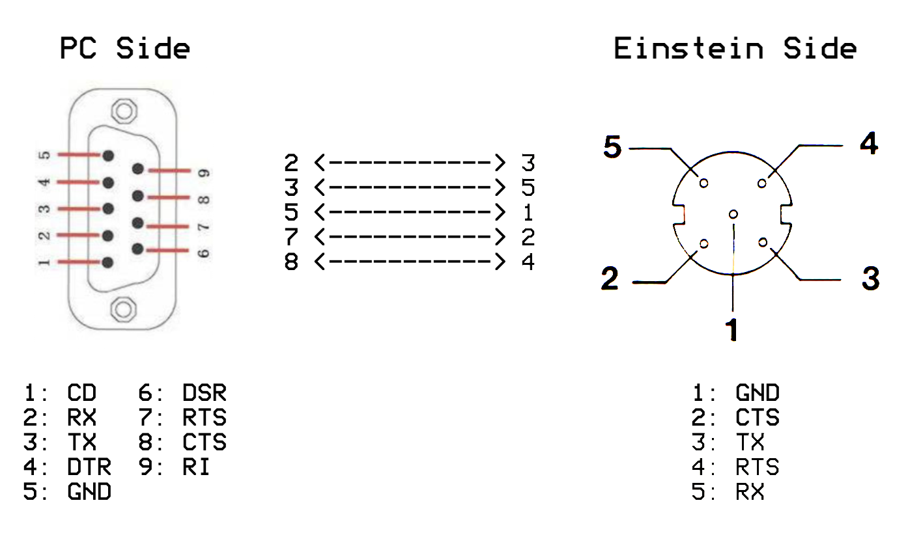

# einstein-eintrans

EinTrans is a utility written by Ste Ruddy for transferring files between a PC and Tatung Einstein TC-01 over a serial cable. Ste was a colleague at Software Creations and he was respected for his in-house utilities alongside his games development skills. This is an application I used a handful of times at Software Creations for transferring source code from my Tatung when our development systems moved to PCs.

### The plan

This is an attempt to reverse engineer the utility suite EinTrans wrtten by Ste Ruddy in 2002

- To preserve and document the code
- To write a modern and cross-platform PC/Mac client

### Contents

This Git contains:

- A disassembly of EINTRANS.COM that will compile a binary identical version of Ste's original version
- A Python library that can connect to EINTRANS.COM from a PC

### Requirements

- A Tatung Einstein TC-01 with a working floppy drive (or equivalent, i.e. Gotek).
- A PC with a serial port
- A Tatung to PC null modem cable
- A blank 3″ floppy drive (required if using a floppy drive)

NB: I have had problems with my CH340 based USB serial adaptor, specifically with handshaking, so if possible, use a PC with a built-in serial port. On my desktop PC, I use a dual serial card based on the WCH CH352 chipset in Ubuntu. A guide for installing that can be found on my blog [here](http://www.breakintoprogram.co.uk/hardware/installing-a-wch-ch352-pci-serial-card-on-a-linux-pc).

### Making the serial cable

I found a supplier of custom cables, including those for the Einstein online. Unfortunately they are no longer trading, so your only option at the moment is to either make one yourself, or find someone to make one for you.

The wiring diagram is as follows:

NB: Both connectors are pictured from the rear, i.e. solder-side.

### Copying EINTRANS.COM to the Einstein

I am working on a simpler approach, but for the time being please follow the instructions on my blog [here](http://www.breakintoprogram.co.uk/hardware/tatung-einstein/a-guide-to-eintrans). This will create a blank system disk with EINTRANS.COM on it.

### Thanks

- To Ste Ruddy for the original code
- To Chris Coxall for archiving the binaries on his website http://www.connectingcomputers.xyz/tatungeinstein/einsys.html